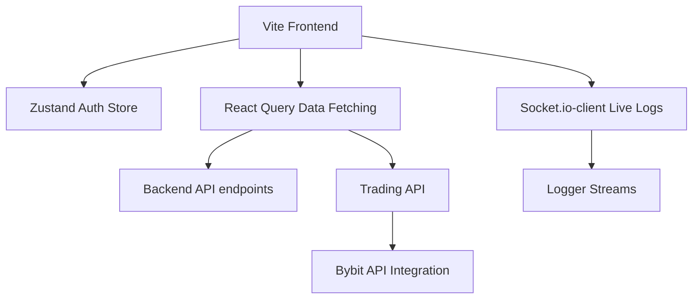

# Implementation Report: Huebox Dashboard & MyPortfolio

This report details the technical implementation and recent updates across the two active repositories.

---

## 1. Huebox Dashboard (`e:\BS\huebox-dashboard`)

A React administration dashboard built with **Vite**, **TypeScript**, and **Tailwind CSS v4** to manage, control, and execute trades through an AI-powered cryptocurrency trading bot.

### Key Functional Features
*   **Engine & Bot Control:**
    *   **State Control:** Real-time resume/pause functionality (`/api/bot/resume` and `/api/bot/pause`) to start or halt signal execution and grid placement loops.
    *   **Strategy Settings:** Switch between predefined strategy profiles: Conservative (`moderate`), Balanced (`balanced`), and Aggressive (`aggressive`).
    *   **AI Personality Matcher:** A filtering module that queries `/api/bot/filter` with preferences for *Duration* (short/medium/long-term), *Return* (5% to 30%+), and *Risk* (low/moderate/high) to retrieve matched bot profiles complete with target statistics (leverage, take profit, stop loss, hold limit, risk tier).
    *   **Developer Simulation:** Testing hook to trigger simulated deposits (`/api/bot/dev/simulate-deposit`), mimicking webhook payloads to launch python execution processes.
*   **Interactive Trading Interface:**
    *   **Portfolio Status:** Displays total equity, wallet balance, available balance, unrealised PnL, margin requirements, account LTV, and cumulative realised profit.
    *   **Positions Table:** Displays active positions, including entry prices, mark/liquidation boundaries, sizes, leverage settings, and real-time unrealised PnL.
    *   **Order Execution:** Form controls to place limit and market orders (Buy/Sell) with instant query invalidation for immediate state updates.
    *   **Order Cancellation & Position Liquidation:** Supports canceling outstanding orders and closing open positions.
    *   **Market Charts:** Displays historical BTC candlestick candles fetched by selected interval (e.g., minutes/hours/daily) alongside a 24h ticker display.
*   **Real-time Log Stream:**
    *   Uses `socket.io-client` in `useLogStream` to bind a WebSocket connections stream, piping backend logs directly onto an interactive terminal console.
*   **Payments Integration:**
    *   Moonplay payment gateway integration for cryptocurrency deposits.
    *   Return and callback handling pages (`PaymentReturn.tsx`) to process transaction status.
*   **Analytics & Metrics:**
    *   Performance tracking modules plotting daily and cumulative PnL metrics.
*   **Admin & System Panels:**
    *   Admin user administration dashboard (`AdminUsers.tsx`).
    *   System health settings console (`System.tsx`) monitoring environments and daemon configurations.

---

## 2. Professional Portfolio (`e:\MyPortfolio`)

A Next.js static and server-rendered portfolio website highlighting professional achievements, projects, and technical skills.

### Key Functional Features & Recent Updates
*   **Professional Summary Update:**
    *   Refocused career positioning as an **AI Software Engineer** with core expertise in Python, C#, JS/TS, Java, and SQL.
    *   Stressed capabilities in building backend architectures (FastAPI, NestJS, .NET, Node.js, Express.js), LLM-powered applications, and Agentic RAG pipelines.
*   **Refactored Experience Timeline:**
    *   **Backergy Soft (Dubai - Remote):** Software Engineer (Nov 2025 – Present). Focuses on full-stack apps (Next.js, NestJS, Express.js, PostgreSQL, MongoDB), Agentic AI, RAG pipelines, and AWS/Docker container deployments.
    *   **Jay Jay Mills Lanka PVT LTD (Sri Lanka - Onsite):** AI Software Engineer & Business Transformation Executive (Mar 2025 – Dec 2025). Focuses on enterprise digitization, IoT sensors telemetry integration, and Azure deployments.
    *   **Expernetic PVT LTD (Sri Lanka - Onsite):** Intern Software Engineer (Jul 2024 – Mar 2025). Developed .NET services, CQRS patterns, and Azure microservices.
    *   **Corporate Services (PVT) LTD:** Data Management Coordinator (Jan 2024 – May 2024).
*   **AI/ML & Full-Stack Projects Portfolio:**
    *   Re-enabled the projects catalog showcasing 5 key projects:
        1.  **Career Guidance Platform:** Recommendations via KNN/Decision trees, RAG pipelines, adaptive surveys (FastAPI, Next.js, MongoDB, LangChain).
        2.  **Multi-Agent Travel Assistant:** Travel planner using LangGraph orchestration, ChromaDB vector databases, FastAPI, Redis, and Streamlit dashboards.
        3.  **AutoCurate:** Curation feeder using RAG pipelines, FAISS/Pinecone indexing, and Celery task queues.
        4.  **Neural Machine Translation (NMT):** English ↔ Tamil fine-tuned T5 Transformer model serving real-time translations via FastAPI/Next.js.
        5.  **Object Detection:** YOLOv5 computer vision app classifying 80 COCO categories (FastAPI, Next.js, Docker).
*   **Updated Skills Inventory:**
    *   Added modern tooling profiles highlighting AI Agents / RAG, FastAPI, NestJS, Tailwind CSS, PostgreSQL, Redis, GitHub Actions, AWS, Azure, and Vercel.
